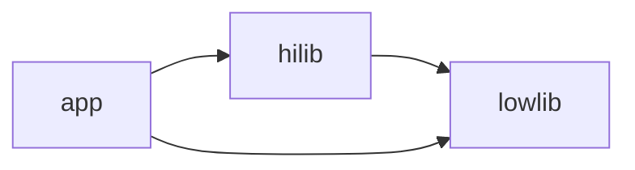

```bash
pushd lowlib && (npm install && npm pack); popd;                    # lowlib
pushd hilib && (npm install && npx ropm install && npm pack); popd; # hilib
pushd app && (npm install && npx ropm install && npm start); popd;  # app
```
